---
lab:
    title: 'Apache Spark を使用してデータの探索と変換を行い、データ ウェアハウスに読み込む'
    module: 'モジュール 4'
---

# ラボ 4 - Apache Spark を使用してデータの探索と変換を行い、データ ウェアハウスに読み込む

このラボでは、データ レイクに格納されているデータを探索し、データを変換して、リレーショナル データ ストアにデータを読み込む方法を学びます。Parquet ファイルと JSON ファイルを探索し、階層構造を使用して JSON ファイルのクエリと変換を実行する技術を使用します。その後、Apache Spark を使用してデータをデータ ウェアハウスに読み込み、データ レイクの Parquet データを専用 SQL プールのデータに統合します。

このラボを完了すると、次のことができるようになります。

- Synapse Studio でデータの探索を行う
- Azure Synapse Analytics で Spark ノートブックを使用してデータを取り込む
- Azure Synapse Analytics の Spark プールで DataFrame を使用してデータを変換する
- Azure Synapse Analytics で SQL プールと Spark プールを統合する

## ラボの構成と前提条件

このラボを開始する前に、ラボ環境を作成するためのセットアップ手順が正常に完了していることを確認してください。次に、次のセットアップ タスクを完了して、専用の SQL プールを作成します。

> **注**: セットアップ タスクには約 6 ～ 7 分かかります。スクリプトの実行中は、ラボを続行できます。

### タスク 1: 専用 SQL プールを作成する

1. Synapse Studio (<https://web.azuresynapse.net/>) を開きます。

2. 「**管理**」ハブを選択します。

    

3. 左側のメニューで「**SQL プール**」を選択してから、「**+ 新規**」を選択します。

    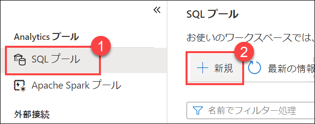

4. 「**専用 SQL プールの作成**」ページで、プール名に **`SQLPool01`** (ここに表示されているとおりにこの名前を使用する<u>必要があります</u>) を入力してから、パフォーマンス レベルを **DW100c** に設定します (スライダーを左端まで移動します)。

5. 「**Review + create**」をクリックします。次に、検証手順で「**作成**」を選択します。
6. 専用 SQL プールが作成されるまで待ちます。

> **重要:** 開始されると、専用 SQL プールは、一時停止されるまで Azure サブスクリプションのクレジットを消費します。このラボを休憩する場合、またはラボを完了しないことにした場合は、ラボの最後にある指示に従って、**SQL プールを一時停止してください**

### タスク 2: PowerShell スクリプトを実行する

1. このコースで提供されるホストされた VM 環境で、管理者モードで Powershell を開き、以下を実行して実行ポリシーを無制限に設定し、ローカルの PowerShell スクリプト ファイルを実行できるようにします。

    ```
    Set-ExecutionPolicy Unrestricted
    ```

    > **注**: 「信頼できないリポジトリからモジュールをインストールしようとしています。」というプロンプトが表示された場合は、「**すべてはい**」を選択してセットアップを続行します。

2. ローカル ファイル システム内のこのリポジトリのルートにディレクトリを変更します。

    ```
    cd C:\dp-203\data-engineering-ilt-deployment\Allfiles\00\artifacts\environment-setup\automation\
    ```

3. 次のコマンドを入力して、SQL プールにオブジェクトを作成する PowerShell スクリプトを実行します。

    ```
    .\setup-sql.ps1
    ```

4. Azure にサインインするように求められ、ブラウザーが開きます。資格情報を使用してサインインします。サインインした後、ブラウザーを閉じて Windows PowerShell に戻ることができます。

5. プロンプトが表示されたら、Azure アカウントに再度サインインします (これは、スクリプトが Azure サブスクリプションのリソースを管理できるようにするために必要です。必ず以前と同じ資格情報を使用してください)。

6. 複数の Azure サブスクリプションがある場合は、プロンプトが表示されたら、サブスクリプションの一覧にその番号を入力して、ラボで使用するサブスクリプションを選択します。

7. プロンプトが表示されたら、Azure Synapse Analytics ワークスペースを含むリソース グループの名前 (**data-engineering-synapse-*xxxxxxx*** など) を入力します。

8. このスクリプトの実行中に**演習 1 に進みます**。

> **注** このスクリプトは、完了するまでに約 2 〜 3 分かかります。
> 
> SQLPool01 専用 SQL プール (3 つあります) のリンクされたサービスの作成中にスクリプトがハングしたように見える場合は、**Enter** キーを押します。これにより、PowerShell スクリプトが更新され、最後まで続行できます。
>
> ### 無視できる潜在的なエラー
>
> スクリプトの実行中に、エラーと警告が発生する場合があります。以下のエラーは無視しても問題ありません。
> 
> 1. 次のエラーは、SQL ユーザーを作成し、専用 SQL プールにロールの割り当てを追加するときに発生する可能性があり、無視しても問題ありません。
>
>       *プリンシパル 'xxx@xxx.com' を作成できませんでした。Active Directory アカウントで確立された接続のみが、他の Active Directory ユーザーを作成できます。*
>
>2. 次のエラーも発生する可能性があり、無視しても問題ありません。
>
>       *07-create-wwi-perf-sale-heap with label CTAS : Sale_Heap. null 配列にインデックスを作成できません。*

## 演習 1 - Synapse Studio でデータの探索を行う

データ インジェスト中にデータ エンジニアが最初に行うタスクのひとつは通常、インポートされるデータを探索することです。データ探索により、エンジニアはインジェストされるファイルの内容をよりよく理解できます。このプロセスは、自動インジェスト プロセスの障害になる可能性があるデータの品質の問題を特定する上で役立ちます。探索により、データの種類やデータの品質のほか、データをデータ レイクにインポートする前、または分析ワークロードで使用する前にファイル上で処理が必要かどうかを把握できます。

一部の売上データをデータ ウェアハウスに取り込んでいる際に問題が発生したため、Synapse Studio を使用して問題を解決できる方法を知りたいというリクエストが Tailspin Traders のエンジニアから届きました。このプロセスの最初の手順として、データを探索し、何が問題の原因となっているのか突き止めて解決策を提供する必要があります。

### タスク 1: Azure Synapse Studio でデータ プレビューアを使用してデータを探索する

Azure Synapse Studio には、シンプルなプレビュー インターフェイスから、Synapse Spark ノートブックを使用したより複雑なプログラミング オプションにいたるまで多数のデータ探索方法が備えられています。この演習では、このような機能を利用して、問題のあるファイルの探索、識別、修正を行う方法をが学びます。データ レイクの **wwi-02/sale-poc** フォルダーに格納されている CSV ファイルを探索し、問題の識別・修正方法を学習します。

1. Azure Synapse Studio で「**データ**」ハブに移動します。

    

    > 「データ」ハブから、ワークスペース内のプロビジョニングされた SQL プール データベースと SQL サーバーレス データベースのほか、ストレージ アカウントやその他のリンク サービスなどの外部データ ソースにアクセスできます。

2. ここでは、ワークスペースのプライマリ データ レイクに格納されたファイルにアクセスしたいので、「データ」ハブ内で「**リンク済み**」タブを選択します。

    

3. 「リンク済み」タブで **Azure Data Lake Storage Gen2** を展開した後、ワークスペース用に**プライマリ** データ レイクを展開します。

    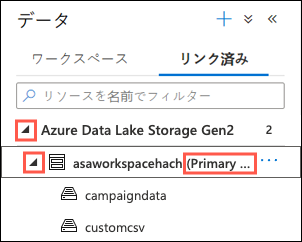

4. プライマリ データ レイク ストレージ アカウント内のコンテナーのリストで、**wwi-02** コンテナーを選択します。

    

5. コンテナー エクスプローラー ウィンドウで、**sale-poc** を参照します。

    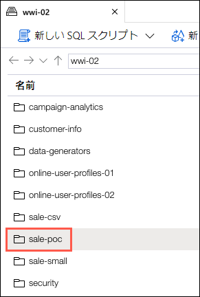

6. **sale-poc** には、2017 年 5 月の売上データが含まれています。フォルダー内にいくつかのファイルがあります。これらのファイルは一時的なプロセスによって、Tailspin のインポート プロセスに関して問題のあるアカウントにインポートされました。数分かけて一部のファイルを探索してみましょう。

7. **sale-20170501.csv** リストで最初のファイルを右クリックし、コンテキスト メニューから「**プレビュー**」を選択します。

    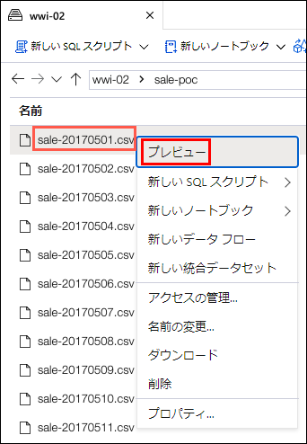

8. Synapse Studio の「プレビュー」では、コードを書かなくてもファイルのコンテンツをすばやく調べることができます。これは、個々のファイルに格納されているデータの特徴 (列) と種類を基本的に把握できる効果的な方法です。

    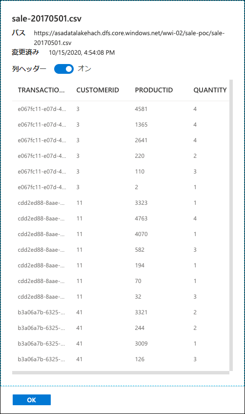

    > **sale-20170501.csv** の「プレビュー」ダイアログをスクロールして、ファイルのプレビューを確認します。スクロール ダウンすると、プレビューに含まれる行数が限定されていますが、ファイルの構造を確認することはできます。右側にスクロールすると、ファイルに含まれているテルの数と名前が表示されます。

9. 「**OK**」を選択してプレビューを閉じます。

10. データ探索を行う際は、複数のファイルを見てみることが重要です。データのより代表的なサンプルを確認できます。フォルダーで次のファイルを見てみましょう。**sale-20170502.csv** ファイルを右クリックして、コンテキスト メニューから「**プレビュー**」を選択します。

    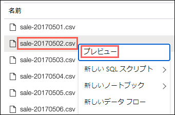

11. このファイルの構造が **sale-20170501.csv** ファイルとは異なることに注意してください。プレビューにはデータ行が表示されず、列のヘッダーにはフィールド名ではなくデータが含まれています。

    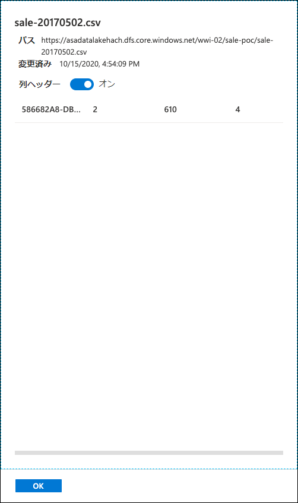

12. このファイルには列ヘッダーが含まれていないようです。「**列のヘッダーを付ける**」オプションを「**オフ**」に設定し (変更には時間がかかる場合があります)、結果を確認します。

    ![sale-20170502.csv ファイルのプレビュー ダイアログが表示され、[列のヘッダーを付ける] オプションがオフになっています。](images/sale-20170502-csv-preview-with-column-header-off.png "CSV File preview")

    > 「**列のヘッダーを付ける**」オプションをオフにすると、ファイルに列のヘッダーが含まれていないことを確認できます。ヘッダーではすべての行に "(NO COLUMN NAME)" が含まれています。この設定により、データは適切に下方に移されます。これは 1 行のみのようです。右にスクロールすると、行は 1 行しかないように見える一方、最初にプレビューしたファイルよりも列が多いことがわかります。11 列が含まれています。

13. 2 つの異なるファイル構造を見てきましたが、別のファイルを確認し、**sale-poc** フォルダーではどのファイル形式がより典型的なのかチェックしましょう。**sale-20170502.csv** のプレビューを閉じてから、**sale-20170503.csv** のプレビューを開きます。

    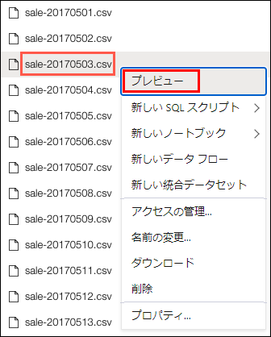

14. **sale-20170503.csv** ファイルの構造が **20170501.csv** の構造に類似していることを確認します。

    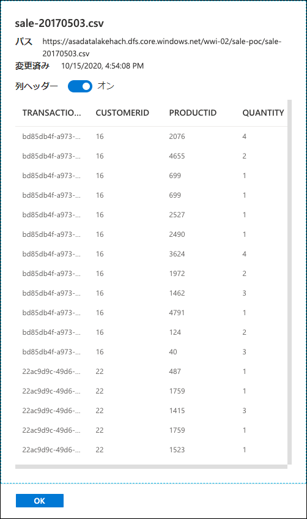

15. 「**OK**」を選択してプレビューを閉じます。

### タスク 2: サーバーレス SQL プールを使用してファイルを探索する

Synapse Studio のプレビュー機能を使用すると、ファイルをすばやく探索できますが、データをより詳細に確認したり、問題のあるファイルの情報を得たりすることはできません。このタスクでは、Synapse の**サーバーレス SQL プール (組み込み)** 機能を使用して、T-SQL でこれらのファイルを探索します。

1. **sale-20170501.csv** ファイルを再び右クリックしてください。今回は、コンテキスト メニューから「**新しい SQL スクリプト**」と「**上位 100 行を選択**」を選択します。

    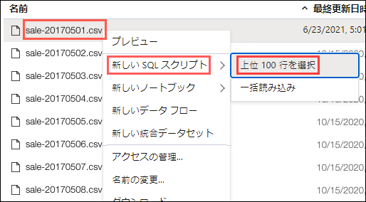

2. 新しい SQL スクリプトのタブが Synapse Studio で開きます。ファイルの最初の 100 行を読み取るための SELECT ステートメントが含まれています。これは、ファイルの内容を調べるもうひとつの方法です。調べる行数を限定することで、探索プロセスをスピードアップできます。ファイル内ですべてのデータを読み込むクエリは実行に時間がかかるのです。

    

    > **ヒント**: スクリプトの「**プロパティ**」ウィンドウを非表示にして、スクリプトを見やすくします。

    データ レイクに格納されているファイルに対する T-SQL クエリは、OPENROWSET 関数を利用します。この関数は、クエリの FROM 句でテーブルのように参照できます。組み込みの BULK プロバイダーによる一括操作がサポートされ、ファイルのデータを行セットとして読み取り、返すことができます。詳細については、[OPENROWSET ドキュメント](https://docs.microsoft.com/azure/synapse-analytics/sql/develop-openrowset)を参照してください。

3. ツールバーで「**実行**」を選択してクエリを実行します。

    

4. 「**結果**」ペインで出力を確認します。

    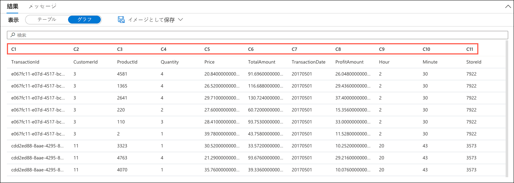

    > 結果では、列ヘッダーが含まれている最初の行がデータ行となり、列に **C1** - **C11** の名前が割り当てられていることがわかります。OPENROWSET 関数の FIRSTROW パラメーターを使用すると、データとして表示するファイルの最初の行の数を指定できます。既定値は 1 です。ファイルにヘッダー行が含まれている場合は、値を 2 に設定すると列のヘッダーをスキップできます。その後、`WITH` 句を使用すると、ファイルに関連のあるスキーマを指定できます。

5. 以下に示すようにクエリを変更して、ヘッダー行をスキップし、結果セットの列の名前を指定します。 *SUFFIX* をストレージ アカウントの一意のリソース サフィックスに置き換えます。

    ```sql
    SELECT
        TOP 100 *
    FROM
        OPENROWSET(
            BULK 'https://asadatalakeSUFFIX.dfs.core.windows.net/wwi-02/sale-poc/sale-20170501.csv',
            FORMAT = 'CSV',
            PARSER_VERSION='2.0',
            FIRSTROW = 2
        ) WITH (
            [TransactionId] varchar(50),
            [CustomerId] int,
            [ProductId] int,
            [Quantity] int,
            [Price] decimal(10,3),
            [TotalAmount] decimal(10,3),
            [TransactionDate] varchar(8),
            [ProfitAmount] decimal(10,3),
            [Hour] int,
            [Minute] int,
            [StoreId] int
        ) AS [result]
    ```

    

    > OPENROWSET 関数を使用すると、T-SQL 構文でデータをさらに探索できます。たとえば、WHERE 句を使用すると *null* または高度な分析ワークロードでデータを使用する前に対応する必要のある他の値について、さまざまなフィールドをチェックできます。スキーマを指定すると、名前を使ってフィールドを参照し、このプロセスを容易にすることが可能です。

6. 「SQL スクリプト」タブを閉じます。プロンプトが表示されたら、「**変更を破棄して閉じる**」を選択します。

    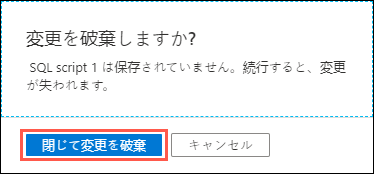

7. **プレビュー**機能を使用している際、**sale-20170502.csv** ファイルの形式が不良であることが判明しました。T-SQL を使用して、このファイルのデータに関する詳しい情報を得られるか見てみましょう。**wwi-02** タブに戻り、`**sale-20170502.csv** ファイルを右クリックして、「**新しい SQL スクリプト**」と「**上位 100 行を選択**」を選択します。

    

8. 自動生成されたクエリを実行します。

    

9. クエリにより、エラー、「*外部ファイルの取り扱いエラー: '許可されている最大行サイズ 8388608 バイトを超え、バイト 0 で始まる行が見つかりました。'* が発生することを確認します。

    

    > このエラーは、このファイルのプレビュー ウィンドウに表示されていたものと同じです。プレビューでは、データは列に分割されていましたが、すべてのデータが 1 行に含まれていました。これは、既定のフィールド区切り記号 (コンマ) を使用してデータが列に分割されていることを示唆します。ただし、行の終端記号 `\r` が欠落しているようです。

10. クエリ タブを閉じて変更を破棄し、**wwi-02** タブで **sale-20170502.csv** ファイルを右クリックして、「**ダウンロード**」を選択します。これにより、ファイルがダウンロードされ、ブラウザーで開かれます。

11. ブラウザーでデータを確認し、行終端文字がないことに注意してください。 すべてのデータが 1 行に含まれています (ブラウザーの表示で折り返されます)。

12. **sale-20170502.csv** ファイルの内容を含むブラウザー タブを閉じます。

    ファイルを修正するには、コードを使う必要があります。T-SQL と Synapse パイプラインには、このタイプの問題に効率よく対応できる機能が備わっていません。このファイルの問題に取り組むために、Synapse Spark ノートブックを使用する必要があります。

### タスク 3: Synapse Spark を使用してデータの探索と修正を行う

このタスクでは、Synapse Spark ノートブックを使用してデータ レイクの **wwi-02/sale-poc** フォルダー内のファイルをいくつか探索します。また、Python コードを使用して **sale-20170502.csv** ファイルの問題を修正し、後ほど Synapse パイプラインを使用してディレクトリのファイルがすべて取り込まれるようにします。

1. Synapse Studio で、「**開発**」ハブを開きます。

    

2. 「**+**」メニューで、「**インポート**」を選択します。

    

3. **Explore with Spark.ipynb** ノートブックを C:\dp-203\data-engineering-ilt-deployment\Allfiles\synapse-apache-spark-notebooks フォルダーにインポートします。

4. ノートブックに含まれている指示に従って、このタスクの残りを完了し、**SparkPool01** Spark プールに接続します。Spark プールを開始する必要があるため、最初のセルの実行には時間がかかる場合があることに注意してください。 

5. **Explore with Spark** ノートブックを完了したら、ノートブック ツール バーの右側にある「**セッションの停止**」ボタンを選択して、次の演習のために Spark クラスターを解放します。

    

## 演習 2 - Azure Synapse Analytics で Spark ノートブックを使用してデータを取り込む

Tailwind Traders には、さまざまなデータ ソースからの非構造化ファイルと半構造化ファイルがあります。同社のエンジニアは Spark の専門知識を活用して、これらのファイルの探索、インジェスト、変換を行いたいと考えています。

あなたは、Synapse Notebooks を使用するよう推奨しました。これは Azure Synapse Analytics ワークスペースに東尾ぐされており、Synapse Studio 内から利用できます。

### タスク 1: Azure Synapse 向けの Apache Spark を使用してデータ レイクから Parquet ファイルを取り込んで探索する

1. Azure Synapse Studio で、「**データ**」ハブを選択します。
2. 「**リンク済み**」タブの **wwi-02** コンテナーで、*sale-small/Year=2019/Quarter=Q4/Month=12/Day=20191231* フォルダーを参照します。次に、Parquet ファイルを右クリックし、「**新しいノートブック**」を選択して、「**DataFrame に読み込む**」を選択します。

    

    これにより、Spark データフレームにデータを読み込み、ヘッダー付きで 10 行を表示する PySpark コードを含むノートブックが生成されます。

3. **SparkPool01** Spark プールをノートブックに接続しますが、**<u>この段階ではセルを実行しないでください</u>** -  最初にデータ レイクの名前の変数を作成する必要があります。

    

    Spark プールは、すべてのノートブック操作にコンピューティングを提供します。ノートブックのツールバーの下部を見ると、プールがまだ開始されていないことがわかります。プールがアイドル状態のときにノートブックのセルを実行すると、プールが開始され、リソースが割り当てられます。これは、プールのアイドル状態が長すぎて自動で一時停止しない限り、1 回だけの操作になります。

    

    > 自動一時停止の設定は、「管理」ハブの Spark プール構成で行います。

4. セルのコードの下に以下を追加して、**datalake** という名前の変数を定義します。その値は、プライマリ ストレージ アカウントの名前です (*SUFFIX* をデータ ストアの一意のサフィックスに置き換えます)。

    ```python
    datalake = 'asadatalakeSUFFIX'
    ```

    

    この変数は、後のセルで使用されます。

5. ノートブックのツールバーで「**すべて実行**」を選択し、ノートブックを実行します。

    

    > **注:** Spark プールでノートブックを初めて実行すると、Azure Synapse によって新しいセッションが作成されます。これには、2 から 3 分ほどかかる可能性があります。

    > **注:** セルだけを実行するには、セルの上にポインターを合わせ、セルの左側にある「_セルの実行_」アイコンを選択するか、セルを選択してキーボードで **Ctrl+Enter** キーを押します。

6. セルの実行が完了したら、セルの出力でビューを「**グラフ**」に変更します。

    

    既定では、**display()** 関数を使用すると、セルはテーブル ビューに出力されます。出力には、2019 年 12 月 31 日の Parquet ファイルに格納されている販売トランザクション データが表示されます。**グラフ**の視覚化を選択して、データを別のビューで表示してみましょう。

7. 右側にある「**表示のオプション**」ボタンを選択します。

    

8. **キー**を **ProductId**、**値**を **TotalAmount** に設定し、「**適用**」を選択します。

    

9. グラフを視覚化したものが表示されます。棒の上にポインターを合わせると、詳細が表示されます。

    

10. 「**+ コード**」を選択して、下に新しいセルを作成します。

11. Spark エンジンは、Parquet ファイルを分析し、スキーマを推論できます。そのためには、新しいセルに次のように入力して実行します。

    ```python
    df.printSchema()
    ```

    出力は次のようになります。

    ```
    root
     |-- TransactionId: string (nullable = true)
     |-- CustomerId: integer (nullable = true)
     |-- ProductId: short (nullable = true)
     |-- Quantity: byte (nullable = true)
     |-- Price: decimal(38,18) (nullable = true)
     |-- TotalAmount: decimal(38,18) (nullable = true)
     |-- TransactionDate: integer (nullable = true)
     |-- ProfitAmount: decimal(38,18) (nullable = true)
     |-- Hour: byte (nullable = true)
     |-- Minute: byte (nullable = true)
     |-- StoreId: short (nullable = true)
    ```

    Spark がファイルの内容を評価してスキーマを推論します。通常は、この自動推論で、データの探索やほとんどの変換タスクに十分対応できます。ただし、SQL テーブルなどの外部リソースにデータを読み込む場合は、独自のスキーマを宣言し、それをデータセットに適用しなければならない場合があります。ここでは、スキーマは適切であるようです。

12. 次に、集計とグループ化の操作を使用して、データをより深く理解しましょう。新しいコード セルを作成し、次のように入力してセルを実行します。

    ```python
    from pyspark.sql import SparkSession
    from pyspark.sql.types import *
    from pyspark.sql.functions import *

    profitByDateProduct = (df.groupBy("TransactionDate","ProductId")
        .agg(
            sum("ProfitAmount").alias("(sum)ProfitAmount"),
            round(avg("Quantity"), 4).alias("(avg)Quantity"),
            sum("Quantity").alias("(sum)Quantity"))
        .orderBy("TransactionDate"))
    display(profitByDateProduct.limit(100))
    ```

    > クエリを正常に実行するには、スキーマで定義されている集計関数と型を使用するために、必要な Python ライブラリをインポートします。

    出力には、上のグラフで見たものと同じデータが表示されますが、今度は **sum** と **avg** の集計が含まれています。**alias** メソッドを使用して列名を変更していることに注意してください。

    

13. 次の演習のためにノートブックは開いたままにしておきます。

## 演習 3 - Azure Synapse Analytics の Spark プールで DataFrame を使用してデータを変換する

売上データのほかにも、Tailwind Traders 社には e コマース システムの顧客プロファイル データがあり、過去 12 か月間、サイトの訪問者 (顧客) ごとに上位の商品購入数が提供されます。このデータは、データ レイク内の JSON ファイルに格納されています。これらの JSON ファイルの取り込み、調査、および変換に苦労しているため、ガイダンスを希望しています。これらのファイルには階層構造があり、リレーショナル データ ストアに読み込む前にフラット化したいと考えています。また、データ エンジニアリング プロセスの一部としてグループ化操作と集計操作を適用する必要があります。Synapse ノートブックを使用して JSON ファイルのデータ変換を探索してから適用することをお勧めします。

### タスク 1: Azure Synapse で Apache Spark を使用して JSON データのクエリと変換を実行する

1. Spark ノートブックに新しいセルを作成し、次のコードを入力して、セルを実行します。

    ```python
    df = (spark.read \
            .option('inferSchema', 'true') \
            .json('abfss://wwi-02@' + datalake + '.dfs.core.windows.net/online-user-profiles-02/*.json', multiLine=True)
        )

    df.printSchema()
    ```

    > 最初のセルで作成した **datalake** 変数が、ファイル パスの一部としてここで使用されます。

    出力は次のようになります。

    ```
    root
    |-- topProductPurchases: array (nullable = true)
    |    |-- element: struct (containsNull = true)
    |    |    |-- itemsPurchasedLast12Months: long (nullable = true)
    |    |    |-- productId: long (nullable = true)
    |-- visitorId: long (nullable = true)
    ```

    > **online-user-profiles-02** ディレクトリ内のすべての JSON ファイルが選択されていることに注意してください。各 JSON ファイルにはいくつかの行が含まれているため、**multiLine=True** オプションを指定しています。また、**inferSchema** オプションを **true** に設定します。これにより、ファイルを確認し、データの性質に基づいてスキーマを作成するように Spark エンジンに指示します。

2. この時点までは、これらのセルで Python コードを使用してきました。SQL 構文を使用してファイルに対してクエリを実行する場合、1 つのオプションとして、データフレーム内のデータの一時ビューを作成する方法があります。**user_profiles** という名前のビューを作成するには、新しいコード セルで次のコードを実行します。

    ```python
    # create a view called user_profiles
    df.createOrReplaceTempView("user_profiles")
    ```

3. 新しいコード セルを作成します。Python ではなく SQL を使用するため、**%%sql** *マジック*を使用してセルの言語を SQL に設定します。セルで次のコードを実行します。

    ```sql
    %%sql

    SELECT * FROM user_profiles LIMIT 10
    ```

    出力には、**productId** と **itemsPurchasedLast12Months** の値の配列を含む **topProductPurchases** の入れ子になったデータが表示されていることに注意してください。各行の右向きの三角形をクリックすると、フィールドを展開できます。

    

    これにより、データの分析が少し困難になります。これは、JSON ファイルの内容が次のようになっているためです。

    ```json
    [
        {
            "visitorId": 9529082,
            "topProductPurchases": [
                {
                    "productId": 4679,
                    "itemsPurchasedLast12Months": 26
                },
                {
                    "productId": 1779,
                    "itemsPurchasedLast12Months": 32
                },
                {
                    "productId": 2125,
                    "itemsPurchasedLast12Months": 75
                },
                {
                    "productId": 2007,
                    "itemsPurchasedLast12Months": 39
                },
                {
                    "productId": 1240,
                    "itemsPurchasedLast12Months": 31
                },
                {
                    "productId": 446,
                    "itemsPurchasedLast12Months": 39
                },
                {
                    "productId": 3110,
                    "itemsPurchasedLast12Months": 40
                },
                {
                    "productId": 52,
                    "itemsPurchasedLast12Months": 2
                },
                {
                    "productId": 978,
                    "itemsPurchasedLast12Months": 81
                },
                {
                    "productId": 1219,
                    "itemsPurchasedLast12Months": 56
                },
                {
                    "productId": 2982,
                    "itemsPurchasedLast12Months": 59
                }
            ]
        },
        {
            ...
        },
        {
            ...
        }
    ]
    ```

4. PySpark には、配列の各要素に対して新しい行を返す特殊な [**explode**](https://spark.apache.org/docs/latest/api/python/pyspark.sql.html?highlight=explode#pyspark.sql.functions.explode) 関数が含まれています。これにより、読みやすくするため、またはクエリを簡単にするために **topProductPurchases** 列をフラット化できます。新しいコード セルで次のように実行します。

    ```python
    from pyspark.sql.functions import udf, explode

    flat=df.select('visitorId',explode('topProductPurchases').alias('topProductPurchases_flat'))
    flat.show(100)
    ```

    このセルでは、**flat** という名前の新しいデータフレームを作成しました。このデータフレームには、**visitorId** フィールドと、**topProductPurchases_flat** という名前の新しい別名フィールドが含まれています。ご覧のように、出力は少し読みやすく、拡張によって簡単にクエリを実行できます。

    

5. 新しいセルを作成し、次のコードを実行して、**topProductPurchases_flat.productId** フィールドと **topProductPurchases_flat.itemsPurchasedLast12Months** フィールドを抽出してデータの組み合わせごとに新しい行を作成するデータフレームの新しいフラット化されたバージョンを作成します。

    ```python
    topPurchases = (flat.select('visitorId','topProductPurchases_flat.productId','topProductPurchases_flat.itemsPurchasedLast12Months')
        .orderBy('visitorId'))

    topPurchases.show(100)
    ```

    出力には、それぞれの **visitorId** に対して複数の行があることがわかります。

    

6. 過去 12 か月間に購入した項目の数で行を並べ替えてみましょう。新しいコード セルを作成し、次のコードを実行します。

    ```python
    # Let's order by the number of items purchased in the last 12 months
    sortedTopPurchases = topPurchases.orderBy("itemsPurchasedLast12Months")

    display(sortedTopPurchases.limit(100))
    ```

    

7. 逆の順序で並べ替えるにはどうすればよいでしょうか。以下のような呼び出しを行うことができると思われるかもしれません: *topPurchases.orderBy("itemsPurchasedLast12Months desc")*。新しいコード セルで試してみてください。

    ```python
    topPurchases.orderBy("itemsPurchasedLast12Months desc")
    ```

    

    **itemsPurchasedLast12Months desc** は列名と一致しないため、**AnalysisException** エラーが発生していることに注意してください。

    これはなぜ機能しないのでしょうか。

    - **DataFrames** API は SQL エンジンに基づいて構築されています。
    - 一般的に、この API と SQL 構文にはさまざまな知識があります。
    - 問題は、**orderBy(..)** では列の名前が想定されていることです。
    - ここで指定したのは、**requests desc** という形式の SQL 式でした。
    - 必要なのは、このような式をプログラムで表現する方法です。
    - これから導かれるのは、2 番目のバリアント **orderBy(Column)** (具体的には **Column** クラス) です。

8. **Column** クラスは列の名前だけでなく、列レベルの変換 (降順での並べ替えなど) も含まれるオブジェクトです。以前に失敗したコードを次のコードに置き換えて実行します。

    ```python
    sortedTopPurchases = (topPurchases
        .orderBy( col("itemsPurchasedLast12Months").desc() ))

    display(sortedTopPurchases.limit(100))
    ```

    **col** オブジェクトの **desc()** メソッドにより、結果が **itemsPurchasedLast12Months** 列の降順で並べ替えられるようになりました。

    

9. 各顧客が購入した商品の*種類*はいくつありますか。これを知るためには、**visitorId** でグループ化して、顧客ごとの行数を集計する必要があります。新しいコード セルで次のコードを実行します。

    ```python
    groupedTopPurchases = (sortedTopPurchases.select("visitorId")
        .groupBy("visitorId")
        .agg(count("*").alias("total"))
        .orderBy("visitorId") )

    display(groupedTopPurchases.limit(100))
    ```

    **visitorId** 列に対して **groupBy** メソッドを使用し、レコード数に対して **agg** メソッドを使用して、各顧客の合計数を表示するという方法に注目してください。

    

10. 各顧客が購入した*項目の合計数*はいくつですか。これを知るためには、**visitorId** でグループ化して、顧客ごとの **itemsPurchasedLast12Months** の値の合計を集計する必要があります。新しいコード セルで次のコードを実行します。

    ```python
    groupedTopPurchases = (sortedTopPurchases.select("visitorId","itemsPurchasedLast12Months")
        .groupBy("visitorId")
        .agg(sum("itemsPurchasedLast12Months").alias("totalItemsPurchased"))
        .orderBy("visitorId") )

    display(groupedTopPurchases.limit(100))
    ```

    もう一度、**visitorId** でグループ化しますが、ここでは **agg** メソッドの **itemsPurchasedLast12Months** 列に対して **sum** を使用します。**select** ステートメントに **itemsPurchasedLast12Months** 列を含めたため、**sum** で使用できるようになったことに注意してください。

    

11. 次の演習のためにノートブックは開いたままにしておきます。

## 演習 4 - Azure Synapse Analytics で SQL プールと Spark プールを統合する

Tailwind Traders は、Spark でデータ エンジニアリング タスクを実行した後、専用 SQL プールに関連のある SQL データベースに書き込みを行い、他のファイルからのデータを含む Spark データフレームと結合するためのソースとしてその SQL データベースを参照したいと考えています。

Apache Spark と Synapse SQL のコネクタを使用して、Azure Synapse の Spark データベースと SQL データベースの間でデータを効率的に転送できるようにすることを決めます。

Spark データベースと SQL データベース間でのデータの転送は、JDBC を使用して行うことができます。ただし、Spark プールや SQL プールといった 2 つの分散システムでは、JDBC はシリアル データ転送のボトルネックになる傾向があります。

Synapse SQL コネクタへの Apache Spark プールは、Apache Spark 用のデータ ソースの実装です。これにより、Azure Data Lake Storage Gen2 と専用 SQL プールの PolyBase が使用され、Spark クラスターと Synapse SQL インスタンスの間でデータが効率的に転送されます。

### タスク 1: ノートブックを更新する

1. この時点までは、これらのセルで Python コードを使用してきました。Apache Spark プールと Synapse SQL のコネクタを使用する場合、データフレーム内でデータの一時ビューを作成する方法があります。**top_purchases** という名前のビューを作成するには、新しいコード セルで次を実行します。

    ```python
    # Create a temporary view for top purchases so we can load from Scala
    topPurchases.createOrReplaceTempView("top_purchases")
    ```

    フラット化された JSON ユーザー購入データが格納されている、以前に作成した **topPurchases** データフレームから新しい一時ビューを作成しました。

2. Apache Spark pool to Synapse SQL コネクタを使用するコードを Scala で実行する必要があります。これを行うには、セルに **%%spark** マジックを追加します。新しいコード セルで次を実行し、**top_purchases** ビューからの読み取りを行います。

    ```scala
    %%spark
    // Make sure the name of the dedcated SQL pool (SQLPool01 below) matches the name of your SQL pool.
    val df = spark.sqlContext.sql("select * from top_purchases")
    df.write.synapsesql("SQLPool01.wwi.TopPurchases", Constants.INTERNAL)
    ```

    > **注**: セルの実行には 1 分以上かかる場合があります。この前にこのコマンドを実行すると、テーブルが既に存在しているため、"... という名前のオブジェクトが既に存在します" というエラーが表示されます。

    セルの実行が完了したら、SQL テーブルの一覧を見て、テーブルが正常に作成されたことを確認します。

3. **ノートブックは開いたまま**にして、「**データ**」ハブに移動します (まだ選択されていない場合)。

4. 「**ワークスペース**」タブを選択し、**データベース**の**省略記号 (...)** メニューで「**更新**」を選択します。次に、**SQLPool01** データベースとその **Tables** フォルダーを展開し、**wwi.TopPurchases** テーブルとその列を展開します。

    Spark データフレームの派生スキーマに基づいて、**wwi.TopPurchases** テーブルが自動的に作成されました。Apache Spark pool to Synapse SQL コネクタは、テーブルを作成し、そこへデータを効率的に読み込む役割を担っていました。

5. ノートブックに戻り、新しい コード セルで次のコードを実行して、*sale-small/Year=2019/Quarter=Q4/Month=12/* フォルダーにあるすべての Parquet ファイルから売上データを読み取ります。

    ```python
    dfsales = spark.read.load('abfss://wwi-02@' + datalake + '.dfs.core.windows.net/sale-small/Year=2019/Quarter=Q4/Month=12/*/*.parquet', format='parquet')
    display(dfsales.limit(10))
    ```

    

    上のセルのファイル パスを最初のセルのファイル パスと比較します。ここでは、**sale-small** にある Parquet ファイルから、2019 年 12 月 31 日の売上データではなく、**すべての 2019 年 12 月の売上**データを読み込むために相対パスを使用しています。

    次に、前の手順で作成した SQL プールのテーブルから **TopSales** データを新しい Spark データフレームに読み込み、この新しい **dfsales** データフレームと結合してみましょう。これを行うには、Apache Spark プールと Synapse SQL のコネクタを使用して SQL データベースからデータを取得する必要があるため、新しいセルに対して **%%spark** マジックを再度使用する必要があります。次に、Python からデータにアクセスできるように、データフレームの内容を新しい一時ビューに追加する必要があります。

6. 新しいセルで次を実行して、**TopSales** SQL テーブルから読み取りを行い、その内容を一時ビューに保存します。

    ```scala
    %%spark
    // Make sure the name of the SQL pool (SQLPool01 below) matches the name of your SQL pool.
    val df2 = spark.read.synapsesql("SQLPool01.wwi.TopPurchases")
    df2.createTempView("top_purchases_sql")

    df2.head(10)
    ```

    

    セルの言語は、セルの上部で **%%spark** マジックを使用することによって Scala に設定されます。**spark.read.synapsesql** メソッドによって作成された新しいデータフレームとして、**df2** という名前の新しい変数を宣言しました。この変数は、SQL データベースの **TopPurchases** テーブルから読み取りを行います。次に、**top_purchases_sql** という名前の新しい一時ビューを作成しました。最後に、**df2.head(10))** 行で最初の 10 個のレコードを表示しました。セルの出力には、データフレームの値が表示されます。

7. 新しいセルで次のコードを実行して、**top_purchases_sql** 一時ビューから Python で新しいデータフレームを作成し、最初の 10 件の結果を表示します。

    ```python
    dfTopPurchasesFromSql = sqlContext.table("top_purchases_sql")

    display(dfTopPurchasesFromSql.limit(10))
    ```

    

8. 新しいセルで次のコードを実行して、売上の Parquet ファイルと **TopPurchases** SQL データベースのデータを結合します。

    ```python
    inner_join = dfsales.join(dfTopPurchasesFromSql,
        (dfsales.CustomerId == dfTopPurchasesFromSql.visitorId) & (dfsales.ProductId == dfTopPurchasesFromSql.productId))

    inner_join_agg = (inner_join.select("CustomerId","TotalAmount","Quantity","itemsPurchasedLast12Months","top_purchases_sql.productId")
        .groupBy(["CustomerId","top_purchases_sql.productId"])
        .agg(
            sum("TotalAmount").alias("TotalAmountDecember"),
            sum("Quantity").alias("TotalQuantityDecember"),
            sum("itemsPurchasedLast12Months").alias("TotalItemsPurchasedLast12Months"))
        .orderBy("CustomerId") )

    display(inner_join_agg.limit(100))
    ```

    クエリでは、**dfsales** と **dfTopPurchasesFromSql** データフレームを結合し、**CustomerId** と **ProductId** を一致させました。この結合では、**TopPurchases** SQL テーブルのデータと 2019 年 12 月の売上に関する Parquet データを組み合わせました。

    **CustomerId** フィールドと **ProductId** フィールドでグループ化しました。**ProductId** フィールドの名前があいまいである (両方のデータフレームに存在する) ため、**ProductId** の名前を完全に修飾して、その名前を **TopPurchases** データフレームで参照する必要がありました。

    その後、各製品への 12 月の支払いの合計金額、12 月の製品項目の合計数、過去 12 か月間に購入した製品項目の合計数の集計を作成しました。

    最後に、結合および集計されたデータをテーブル ビューで表示しました。

    > **注**: 「テーブル」ビューの列ヘッダーをクリックして、結果セットを並べ替えることができます。

    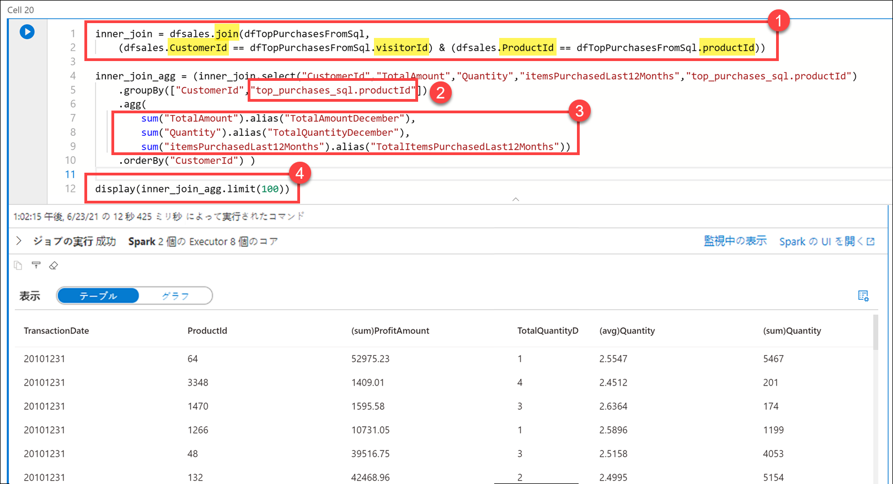

9. ノートブックの右上にある「**セッションの停止**」ボタンを使用して、ノートブックセッションを停止します。
10. 後でもう一度確認する場合は、ノートブックを公開します。次に、それを閉じます。

## 重要: SQL プールを一時停止する

これらの手順を実行して、不要になったリソースを解放します。

1. Synapse Studio で「**管理**」ハブを選択します。
2. 左側のメニューで「**SQL プール**」を選択します。**SQLPool01** 専用 SQL プールにカーソルを合わせ、選択します **||**。

    

3. プロンプトが表示されたら、「**一時停止**」を選択します。
