---
lab:
    title: 'ノートブックのデータを Azure Data Factory または Azure Synapse パイプラインと統合する'
    module: 'モジュール 7'
---

# ラボ 7 - ノートブックのデータを Azure Data Factory または Azure Synapse パイプラインと統合する

Azure Synapse パイプラインでリンク サービスを作成し、データの移動と変換を調整する方法を学習します。

このラボを完了すると、次のことができるようになります。

- Azure Synapse パイプラインでデータの移動と変換を調整する

## ラボの構成と前提条件

このラボを開始する前に、**ラボ 6: *Azure Data Factory または Azure Synapse パイプラインでデータを変換する***を完了してください。

> **注**: ラボ 6 を完了して***いない***が、このコースのラボセットアップを<u>完了</u>している場合は、これらの手順を完了して、必要なリンクされたサービスとデータセットを作成できます。
>
> 1. Synapse Studio の「**管理**」ハブで、次の設定を使用して **Azure Cosmos DB (SQL API)** 用の新しい**リンク サービス**を追加します。
>       - **名前**: asacosmosdb01
>       - **Cosmos DB アカウント名**: asacosmosdb*xxxxxxx*
>       - **データベース名**: CustomerProfile
> 2. 「**データ**」ハブで、次の**統合データセット**を作成します。
>       - asal400_customerprofile_cosmosdb:
>           - **ソース**: Azure Cosmos DB (SQL API)
>           - **名前**: asal400_customerprofile_cosmosdb
>           - **リンク サービス**: asacosmosdb01
>           - **コレクション**: OnlineUserProfile01
>       - asal400_ecommerce_userprofiles_source
>           - **ソース**: Azure Data Lake Storage Gen2
>           - **形式**: JSON
>           - **名前**: asal400_ecommerce_userprofiles_source
>           - **リンク サービス**: asadatalake*xxxxxxx*
>           - **ファイル パス**: wwi-02/online-user-profiles-02
>           - **スキーマのインポート**: 接続/ストアから

## 演習 1 - マッピング データ フローとパイプラインを作成する

この演習では、ユーザー プロファイル データをデータ レイクにコピーするマッピング データ フローを作成した後、データ フローと、このラボで後ほど作成する Spark ノートブックの実行を調整するパイプラインを作成します。

### タスク 1: マッピング データ フローを作成する

1. Synapse Studio (<https://web.azuresynapse.net/>) を開きます。
2. 「**開発**」ハブに移動します。

    

3. 「**+**」メニューで、「**データ フロー**」を選択して新しいデータ フローを作成します。

    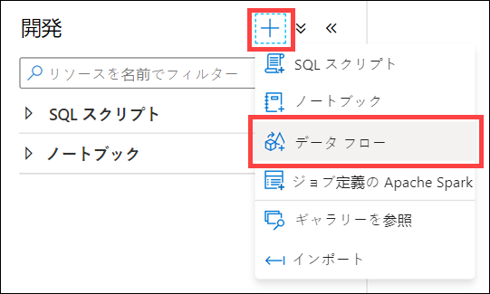

4. 新しいデータ フローの「**プロパティ**」ブレードの「**全般**」設定で、「**名前**」を `user_profiles_to_datalake` に更新します。名前が正確に一致していることを確認します。

    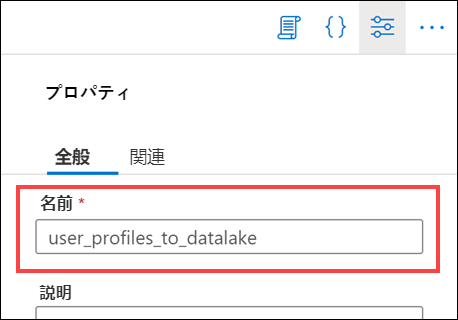

5. データ フロー プロパティの右上で「**{} コード**」ボタンを選択します。

    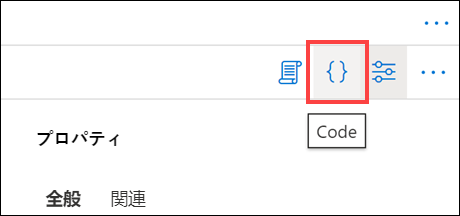

6. 既存のコードを次のコードに置き換え、25 行目の **asadatalake*SUFFIX*** シンク参照名の ***SUFFIX*** をこのラボの Azure リソースの一意のサフィックスに変更します。

    ```
    {
        "name": "user_profiles_to_datalake",
        "properties": {
            "type": "MappingDataFlow",
            "typeProperties": {
                "sources": [
                    {
                        "dataset": {
                            "referenceName": "asal400_ecommerce_userprofiles_source",
                            "type": "DatasetReference"
                        },
                        "name": "EcommerceUserProfiles"
                    },
                    {
                        "dataset": {
                            "referenceName": "asal400_customerprofile_cosmosdb",
                            "type": "DatasetReference"
                        },
                        "name": "UserProfiles"
                    }
                ],
                "sinks": [
                    {
                        "linkedService": {
                            "referenceName": "asadatalakeSUFFIX",
                            "type": "LinkedServiceReference"
                        },
                        "name": "DataLake"
                    }
                ],
                "transformations": [
                    {
                        "name": "userId"
                    },
                    {
                        "name": "UserTopProducts"
                    },
                    {
                        "name": "DerivedProductColumns"
                    },
                    {
                        "name": "UserPreferredProducts"
                    },
                    {
                        "name": "JoinTopProductsWithPreferredProducts"
                    },
                    {
                        "name": "DerivedColumnsForMerge"
                    },
                    {
                        "name": "Filter1"
                    }
                ],
                "script": "source(output(\n\t\tvisitorId as string,\n\t\ttopProductPurchases as (productId as string, itemsPurchasedLast12Months as string)[]\n\t),\n\tallowSchemaDrift: true,\n\tvalidateSchema: false,\n\tignoreNoFilesFound: false,\n\tdocumentForm: 'arrayOfDocuments',\n\twildcardPaths:['online-user-profiles-02/*.json']) ~> EcommerceUserProfiles\nsource(output(\n\t\tcartId as string,\n\t\tpreferredProducts as integer[],\n\t\tproductReviews as (productId as integer, reviewDate as string, reviewText as string)[],\n\t\tuserId as integer\n\t),\n\tallowSchemaDrift: true,\n\tvalidateSchema: false,\n\tformat: 'document') ~> UserProfiles\nEcommerceUserProfiles derive(visitorId = toInteger(visitorId)) ~> userId\nuserId foldDown(unroll(topProductPurchases),\n\tmapColumn(\n\t\tvisitorId,\n\t\tproductId = topProductPurchases.productId,\n\t\titemsPurchasedLast12Months = topProductPurchases.itemsPurchasedLast12Months\n\t),\n\tskipDuplicateMapInputs: false,\n\tskipDuplicateMapOutputs: false) ~> UserTopProducts\nUserTopProducts derive(productId = toInteger(productId),\n\t\titemsPurchasedLast12Months = toInteger(itemsPurchasedLast12Months)) ~> DerivedProductColumns\nUserProfiles foldDown(unroll(preferredProducts),\n\tmapColumn(\n\t\tpreferredProductId = preferredProducts,\n\t\tuserId\n\t),\n\tskipDuplicateMapInputs: false,\n\tskipDuplicateMapOutputs: false) ~> UserPreferredProducts\nDerivedProductColumns, UserPreferredProducts join(visitorId == userId,\n\tjoinType:'outer',\n\tpartitionBy('hash', 30,\n\t\tproductId\n\t),\n\tbroadcast: 'left')~> JoinTopProductsWithPreferredProducts\nJoinTopProductsWithPreferredProducts derive(isTopProduct = toBoolean(iif(isNull(productId), 'false', 'true')),\n\t\tisPreferredProduct = toBoolean(iif(isNull(preferredProductId), 'false', 'true')),\n\t\tproductId = iif(isNull(productId), preferredProductId, productId),\n\t\tuserId = iif(isNull(userId), visitorId, userId)) ~> DerivedColumnsForMerge\nDerivedColumnsForMerge filter(!isNull(productId)) ~> Filter1\nFilter1 sink(allowSchemaDrift: true,\n\tvalidateSchema: false,\n\tformat: 'delta',\n\tcompressionType: 'snappy',\n\tcompressionLevel: 'Fastest',\n\tfileSystem: 'wwi-02',\n\tfolderPath: 'top-products',\n\ttruncate:true,\n\tmergeSchema: false,\n\tautoCompact: false,\n\toptimizedWrite: false,\n\tvacuum: 0,\n\tdeletable:false,\n\tinsertable:true,\n\tupdateable:false,\n\tupsertable:false,\n\tmapColumn(\n\t\tvisitorId,\n\t\tproductId,\n\t\titemsPurchasedLast12Months,\n\t\tpreferredProductId,\n\t\tuserId,\n\t\tisTopProduct,\n\t\tisPreferredProduct\n\t),\n\tskipDuplicateMapInputs: true,\n\tskipDuplicateMapOutputs: true) ~> DataLake"
            }
        }
    }
    ```

7. 「**OK**」を選択します。

8. データ フローは次のようになります。

    

### タスク 2: パイプラインを作成する

この手順では、新しい統合パイプラインを作成してデータ フローを実行します。

1. **統合**ハブの「**+**」メニューで、「**パイプライン**」を選択します。

    

2. 新しいデータ フローの「**プロパティ**」ペインの「**全般**」セクションで、「**名前**」を `User Profiles to Datalake` に更新します。次に、「**プロパティ**」ボタンを選択してペインを非表示にします。

    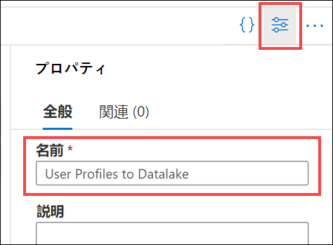

3. アクティビティ リスト内で「**移動と変換**」を展開し、「**データ フロー**」アクティビティをパイプライン キャンバスにドラッグします。

    

4. パイプライン キャンバスの下の「**全般**」タブで「名前」を user_profiles_to_datalake` に設定します。

    

5. 「**設定**」タブで、**user_profiles_to_datalake** データ フローを選択し、**AutoResolveIntegrationRuntime** が選択されていることを確認します。**基本 (汎用)** のコンピューティングの種類を選択し、コア数を **4 (+ 4 ドライバー コア)** に設定します。

    

6. 「**すべて公開**」を選択した後、「**公開**」を選択して、パイプラインを保存します。

    

### タスク 3: パイプラインをトリガーする

1. パイプラインの最上部で「**トリガーの追加**」を選択した後、「**今すぐトリガー**」を選択します。

    

2. このパイプラインにはパラメーターがないため、「**OK**」を選択してトリガーを実行します。

    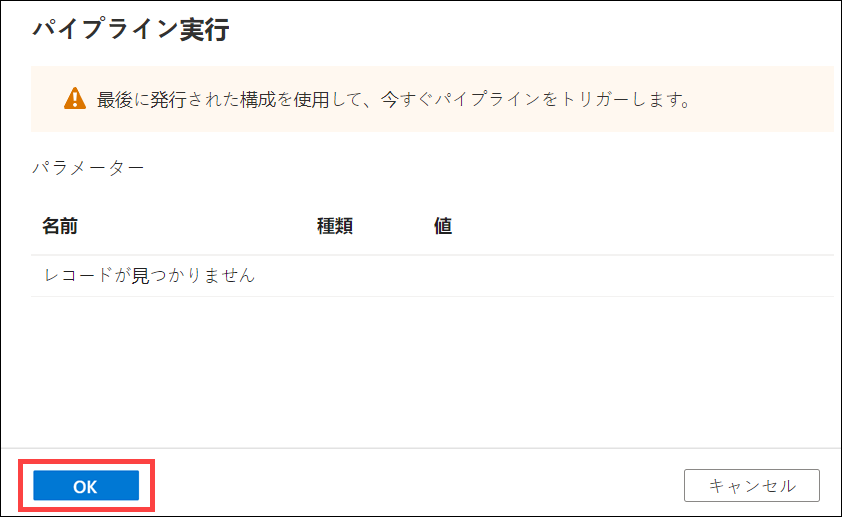

3. 「**監視**」ハブに移動します。

    

4. 「**パイプライン実行**」を選択し、パイプラインの実行が正常に完了するのを待ちます (これには時間がかかります)。場合によっては、ビューを更新する必要があります。

    

## 演習 2 - Synapse Spark ノートブックを作成して上位製品を見つける

Tailwind Traders は Synapse Analytics でマッピング データ フローを使用して、ユーザー プロファイル データの処理、結合、インポートを行っています。どの製品が顧客に好まれ、購入上位なのか、また、過去 12 ヶ月で最も購入されたのはｄの製品かに基づいて各ユーザーの上位 5 製品を把握したいと考えています。その後、全体的な上位 5 製品を計画する予定です。

この演習では、Synapse Spark ノートブックを作成して、このような計算を行います。

### タスク 1: ノートブックを作成する

1. 「**データ**」ハブを選択します。

    

2. 「**リンク**」タブで、**Azure Data Lake Storage Gen2** とプライマリ データ レイク ストレージ アカウントを展開し、**wwi-02** コンテナーを選択します。次に、このコンテナーのルートにある **top-products** フォルダーに移動します (フォルダーが表示されない場合は、**更新** を選択します)。最後に、任意の Parquet ファイルを右クリックし、「**新しいノートブック**」メニュー項目を選択してから「**DataFrame に読み込む**」を選択します。

    

3. ノートブックの右上コーナーで「**プロパティ**」ボタンを選択し、`Calculate Top 5 Products` を**名前**として入力します。次に、「**プロパティ**」ボタンをもう一度クリックしてペインを非表示にします。

4. ノートブックを **SparkPool01** Spark プールに接続します。

    

5. Python コードで、Parquet ファイル名を `*.parquet` に置き換え、**top-products** のすべての Parquet ファイルを選択します。たとえば、パスは次のようになります:    abfss://wwi-02@asadatalakexxxxxxx.dfs.core.windows.net/top-products/*.parquet。

    

6. ノートブックのツールバーで「**すべて実行**」を選択し、ノートブックを実行します。

    

    > **注:** Spark プールでノートブックを初めて実行すると、Synapse によって新しいセッションが作成されます。これには、2 から 3 分ほどかかる可能性があります。

7. 「**+ コード**」を選択して、下に新しいコード セルを作成します。

8. 新しいセルで以下を入力して実行し、**topPurchases** という新しいデータフレームにデータを読み込み、**top_purchases** という新しい一時的なビューを作成して最初の 100 行を示します。

    ```python
    topPurchases = df.select(
        "UserId", "ProductId",
        "ItemsPurchasedLast12Months", "IsTopProduct",
        "IsPreferredProduct")

    # Populate a temporary view so we can query from SQL
    topPurchases.createOrReplaceTempView("top_purchases")

    topPurchases.show(100)
    ```

    出力は次のようになります。

    ```
    +------+---------+--------------------------+------------+------------------+
    |UserId|ProductId|ItemsPurchasedLast12Months|IsTopProduct|IsPreferredProduct|
    +------+---------+--------------------------+------------+------------------+
    |   148|     2717|                      null|       false|              true|
    |   148|     4002|                      null|       false|              true|
    |   148|     1716|                      null|       false|              true|
    |   148|     4520|                      null|       false|              true|
    |   148|      951|                      null|       false|              true|
    |   148|     1817|                      null|       false|              true|
    |   463|     2634|                      null|       false|              true|
    |   463|     2795|                      null|       false|              true|
    |   471|     1946|                      null|       false|              true|
    |   471|     4431|                      null|       false|              true|
    |   471|      566|                      null|       false|              true|
    |   471|     2179|                      null|       false|              true|
    |   471|     3758|                      null|       false|              true|
    |   471|     2434|                      null|       false|              true|
    |   471|     1793|                      null|       false|              true|
    |   471|     1620|                      null|       false|              true|
    |   471|     1572|                      null|       false|              true|
    |   833|      957|                      null|       false|              true|
    |   833|     3140|                      null|       false|              true|
    |   833|     1087|                      null|       false|              true|
    ```

9. 新しいコード セルで以下を実行し、新しい DataFrame を作成して、**IsTopProduct** と **IsPreferredProduct** が両方とも true の顧客に好まれているトップ製品のみを保持します。

    ```python
    from pyspark.sql.functions import *

    topPreferredProducts = (topPurchases
        .filter( col("IsTopProduct") == True)
        .filter( col("IsPreferredProduct") == True)
        .orderBy( col("ItemsPurchasedLast12Months").desc() ))

    topPreferredProducts.show(100)
    ```

    

10. 新しいコード セルで以下を実行し、SQL を使用して新しい一時的なビューを作成します。

    ```sql
    %%sql

    CREATE OR REPLACE TEMPORARY VIEW top_5_products
    AS
        select UserId, ProductId, ItemsPurchasedLast12Months
        from (select *,
                    row_number() over (partition by UserId order by ItemsPurchasedLast12Months desc) as seqnum
            from top_purchases
            ) a
        where seqnum <= 5 and IsTopProduct == true and IsPreferredProduct = true
        order by a.UserId
    ```

    上記のクエリの出力はない点に留意してください。クエリでは **top_purchases** 一時的ビューをソースとして使用し、**row_number() over** メソッドを適用して、**ItemsPurchasedLast12Months** が最大の記録の行番号を各ユーザーに適用します。**where** 句が結果をフィルタリングするので、**IsTopProduct** と **IsPreferredProduct** が true に設定されている製品を最大 5 個まで取得できます。このため、各ユーザーが最も多く購入した上位 5 つの製品が表示されます。これらの製品は、Azure Cosmos DB に格納されているユーザー プロファイルに基づき、お気に入りの製品として_も_識別されています。

11. 新しいコード セルで以下を実行し、前のセルで作成した **top_5_products** 一時ビューの結果が格納されている新しい DataFrame を作成して表示します。

    ```python
    top5Products = sqlContext.table("top_5_products")

    top5Products.show(100)
    ```

    次のような出力が表示され、ユーザーごとに上位 5 つのお気に入り製品が示されるはずです。

    

12. 新しいコード セルで以下を実行し、お気に入り上位製品の数を顧客ごとの上位 5 つのお気に入り製品に比較します。

    ```python
    print('before filter: ', topPreferredProducts.count(), ', after filter: ', top5Products.count())
    ```

    出力は次のようになります。
    
    ```
    before filter:  997817 , after filter:  85015
    ```

13. 新しいコード セルで以下を実行して、顧客のお気に入りと購入トップの両方の製品に基づき、全体的な上位 5 製品を計算します

    ```python
    top5ProductsOverall = (top5Products.select("ProductId","ItemsPurchasedLast12Months")
        .groupBy("ProductId")
        .agg( sum("ItemsPurchasedLast12Months").alias("Total") )
        .orderBy( col("Total").desc() )
        .limit(5))

    top5ProductsOverall.show()
    ```

    このセルでは、お気に入り上位 5 製品を製品 ID でグループ化して、過去 12 ヶ月に購入された合計製品数を加算し、この値を降順で並べ替えて上位 5 つの結果を返しました。出力は次のようになります。

    ```
    +---------+-----+
    |ProductId|Total|
    +---------+-----+
    |      347| 4523|
    |     4833| 4314|
    |     3459| 4233|
    |     2486| 4135|
    |     2107| 4113|
    +---------+-----+
    ```

14. このノートブックはパイプラインから実行します。Parquet ファイルに名前を付けるために使う **runId** 変数値を設定するパラメーターでパスします。新しいコード セルで次のように実行します。

    ```python
    import uuid

    # Generate random GUID
    runId = uuid.uuid4()
    ```

    ランダム GUID を生成するため、Spark に付随している **uuid** ライブラリを使用しています。パイプラインでパスされたパラメーターを使って `runId` 変数をオーバーライドする計画です。このため、これをパラメーター セルとしてトグルする必要があります。

15. セルの上にあるミニ ツールバーでアクションの省略記号 **(...)** を選択してから、「**パラメーター セルの切り替え**」を選択します。

    

    このオプションを切り替えると、セルの右下に「**パラメーター**」という単語が表示され、パラメーター セルであることを示します。

16. 次のコードを新しいコード セルに追加して、プライマリ データ レイク アカウントの */top5-products/* パスの Parquet ファイル名として **runId** 変数を使用します。パス内の ***SUFFIX*** を、プライマリ データ レイク アカウントの一意のサフィックスに置き換えます。これは、ページ上部の**セル 1** にあります。コードを更新したら、セルを実行します。

    ```python
    %%pyspark

    top5ProductsOverall.write.parquet('abfss://wwi-02@asadatalakeSUFFIX.dfs.core.windows.net/top5-products/' + str(runId) + '.parquet')
    ```

    

17. ファイルがデータ レイクに書き込まれていることを確認します。「**データ**」ハブで、「**リンク**」タブを選択します。プライマリ データ レイク ストレージ アカウントを展開し、**wwi-02** コンテナーを選択します。**top5-products** フォルダーに移動します (必要なコンテナーのルートにあるフォルダーを更新します)。ディレクトリに Parquet ファイルのフォルダーが表示され、GUID がファイル名になっているはずです。

    

18. ノートブックに戻ります。ノートブックの右上にある「**セッションの停止**」を選択し、プロンプトが表示されたら今すぐセッションを停止することを確認します。セッションを停止するのは、次のセクションでパイプライン内のノートブックを実行する際に備えてコンピューティング リソースに余裕をもたせるためです。

    

### タスク 2: ノートブックをパイプラインに追加する

Tailwind Traders は、調整プロセスの一環としてマッピング データ フローを実行した後、このノートブックを実行したいと考えています。このため、新しいノートブック アクティビティとしてパイプラインにこのノートブックを追加します。

1. 「**上位 5 製品を計算**」ノートブックに戻ります。

2. ノートブックの右上隅で「**パイプラインに追加**」ボタンを選択してから「**既存のパイプライン**」を選択します。

    

3. 「**ユーザー プロファイルからデータレイク**」パイプラインを選択し、「**追加**」を選択します。

4. Synapse Studio がノートブック アクティビティをパイプラインに追加します。**ノートブック アクティビティ**の配置を変えて、**データ フロー アクティビティ**の右側になるようにします。「**データ フロー アクティビティ**」を選択し、「**成功**」アクティビティ パイプライン接続の**緑色のボックス**を**ノートブック アクティビティ**にドラッグします。

    

    成功アクティビティの矢印は、データ フロー アクティビティの実行が成功した後にノートブック アクティビティを実行するようパイプラインに指示します。

5. 「**ノートブック アクティビティ**」を選択し、「**設定**]タブを選択して、「**ベース パラメーター**」を展開し、「**+ 新規**」を選択します。「**名前**」フィールドに **`runId`** と入力します。「**型**」を「**文字列**」に設定し、「**値**」を「**動的コンテンツを追加する**」に設定します。

    

6. 「**動的コンテンツの追加**」ウィンドウで、「**システム変数**」を展開し、「**パイプライン実行 ID**」を選択します。これにより *@pipeline().RunId* が動的コンテンツ ボックスに追加されます。次に、「**OK**」をクリックしてダイアログを閉じます。

    パイプライン実行 ID 値は、各パイプライン実行に割り当てられている一意の GUID です。この値は、`runId` ノートブック パラメーターとしてパスし、Parquet ファイルの名前で使用します。その後、パイプライン実行履歴を検索し、各パイプライン実行で作成された特定の Parquet ファイルを見つけます。

7. 「**すべて公開**」を選択した後、「**公開**」を選択して変更を保存します。

    

### タスク 3: 更新されたパイプラインを実行する

> **注**: 更新されたパイプラインの実行には 10 分以上かかる場合があります。

1. 公開の完了後、「**トリガーの追加**」を選択してから「**今すぐトリガー**」を選択し、更新されたパイプラインを実行します。

    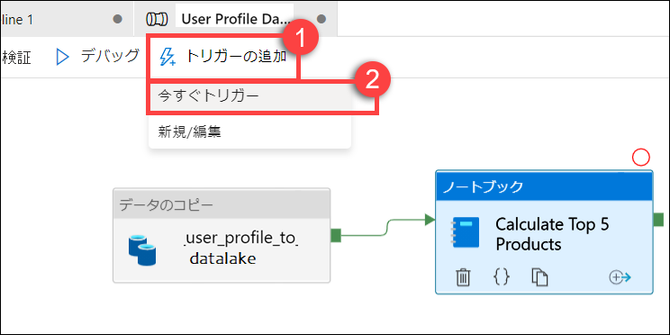

2. 「**OK**」を選択してトリガーを実行します。

    

3. 「**監視**」ハブに移動します。

    

4. 「**パイプライン実行**」を選択し、パイプラインの実行が完了するのを待ちます。場合によっては、ビューを更新する必要があります。

    

    > ノートブック アクティビティが加わると、実行が完了するまでに 10 分以上かかる場合があります。

5. パイプラインの名前 (**データレイクへのユーザー プロファイル**) を選択し、パイプラインのアクティビティ実行を表示します。

6. 今回は、**データ フロー** アクティビティと新しい**ノートブック** アクティビティが両方とも表示されています。**パイプライン実行 ID** の値を書き留めておいてください。これを、ノートブックで生成された Parquet ファイル名に比較します。「**上位 5 製品を計算**」ノートブック名を選択し、その詳細を表示します。

    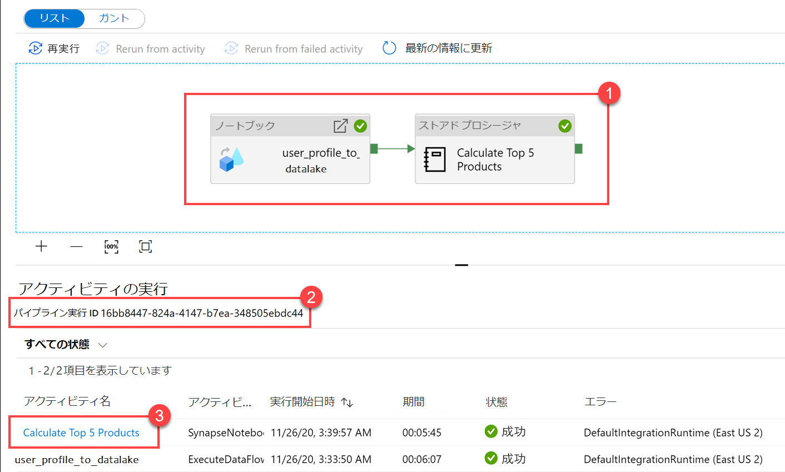

7. ノートブック実行の詳細がここに表示されます。「**再生**」ボタンを選択すると、**ジョブ**の進捗状況を確認できます。最下部には、さまざまなフィルター オプションとともに「**診断**」と「**ログ**」が表示されます。ステージの上にマウスを動かすと、期間や合計タスク数、データ詳細などの詳細な情報を表示できます。詳細を表示したい**ステージ**で「**詳細の表示**」リンクを選択してください。

    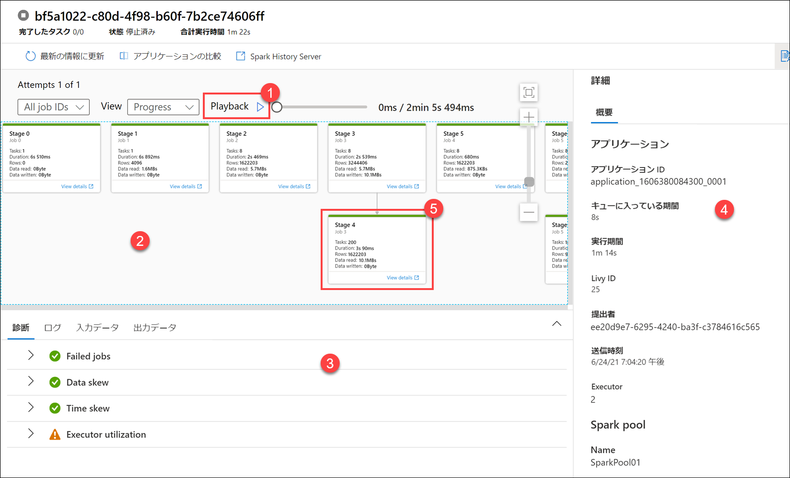

8. Spark アプリケーションの UI が新しいタブで開き、ここにステージの詳細が表示されます。「**DAG 視覚化**」を展開し、ステージの詳細を表示します。

    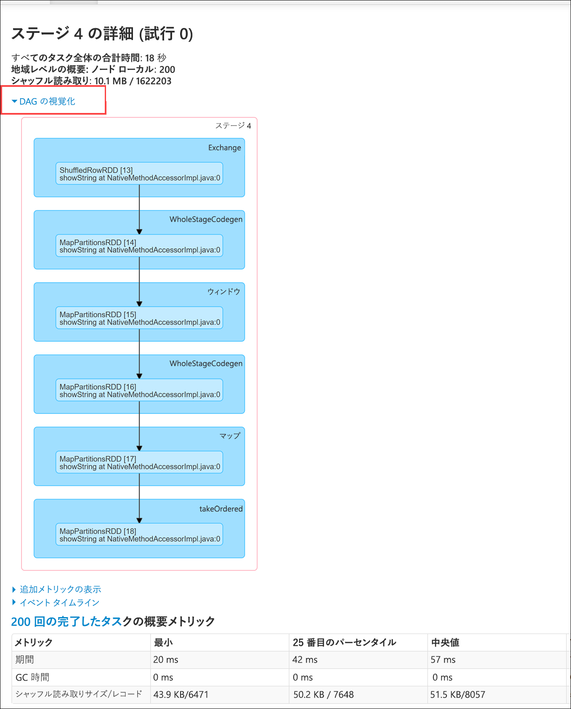

9. 「Spark の詳細」タブを閉じ、Synapse Studio で「**データ**」ハブに戻ります。

    

10. 「**リンク**」タブを選択し、プライマリ データ レイク ストレージ アカウントで **wwi-02**コンテナー を選択します。**top5-products** フォルダーに移動し、名前が「**パイプライン実行 ID**」に一致する Parquet ファイルのフォルダーが存在することを確認します。

    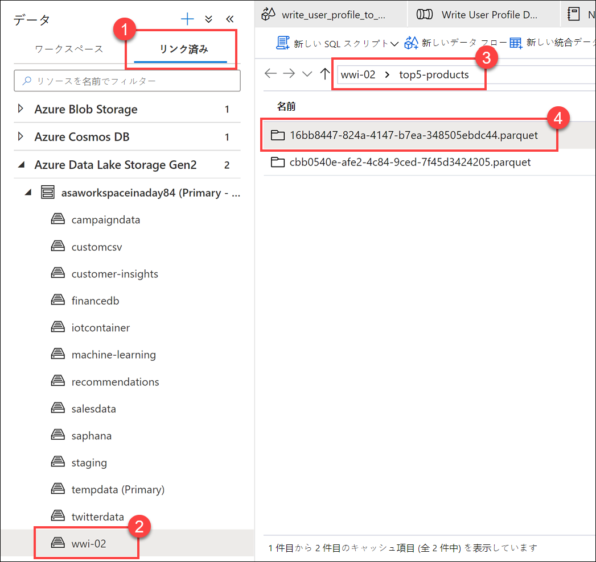

    ご覧のように、名前が「**パイプライン実行 ID**」に一致するファイルがあります。

    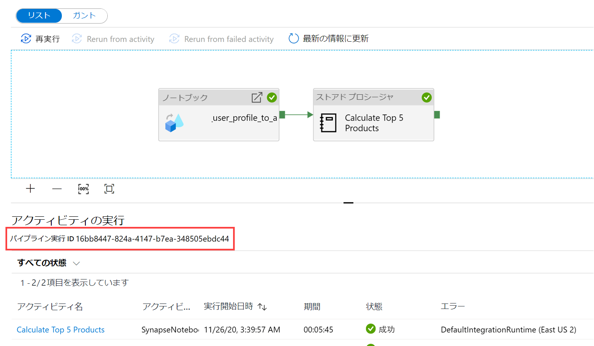

    これらの値が一致するのは、パイプライン実行 ID でノートブック アクティビティの **runId** パラメーターにパスしておいたためです。
